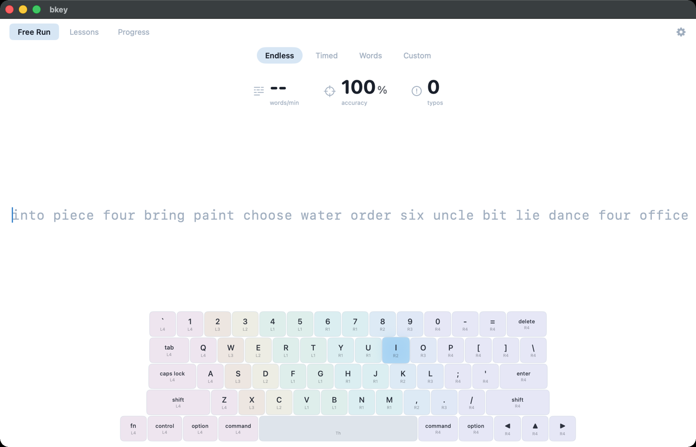
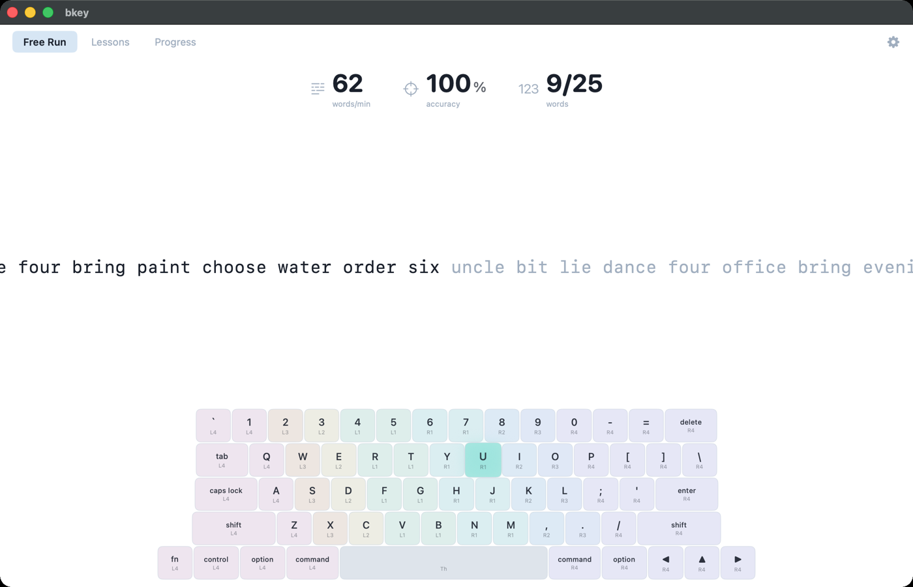
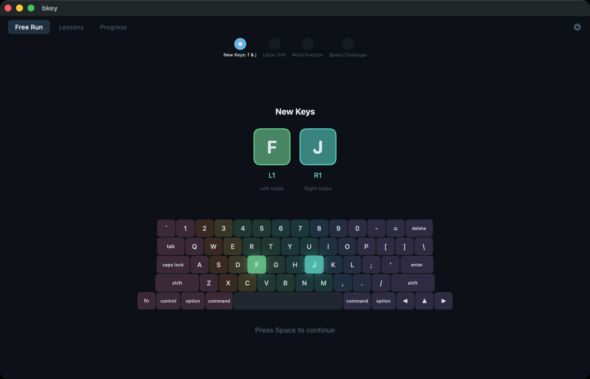
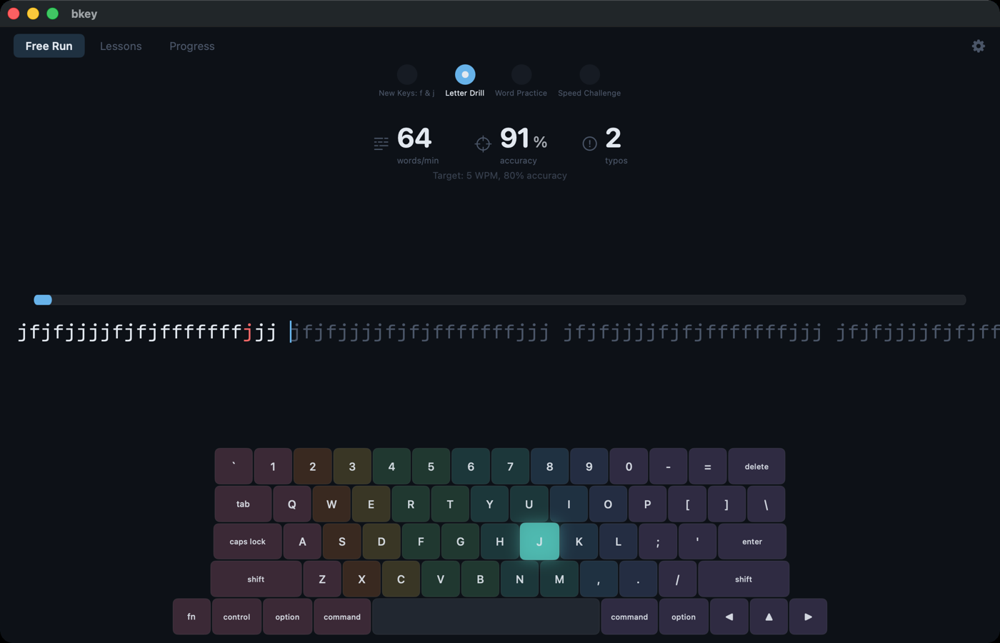
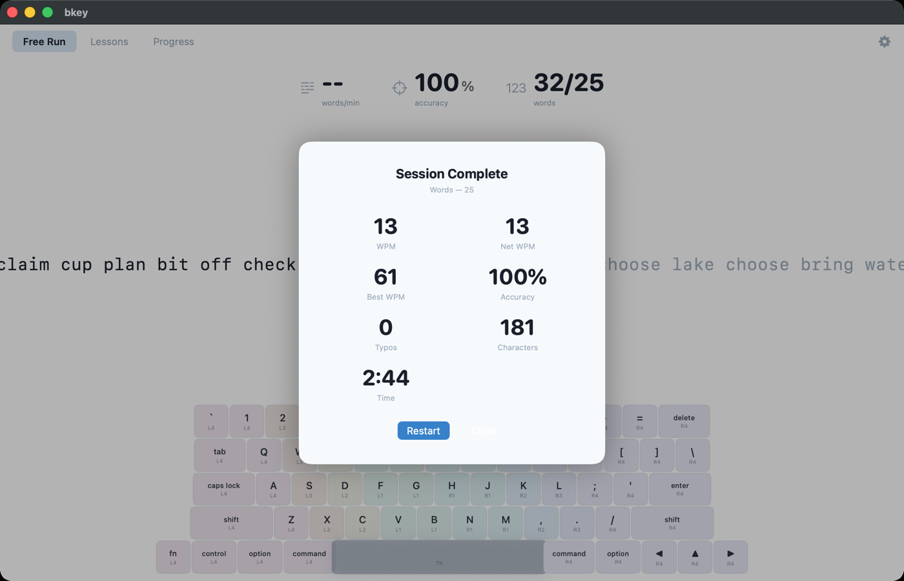
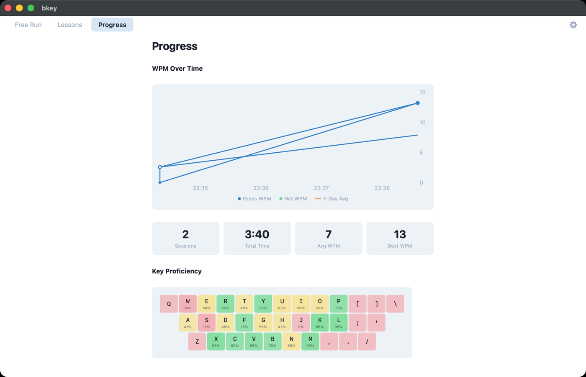
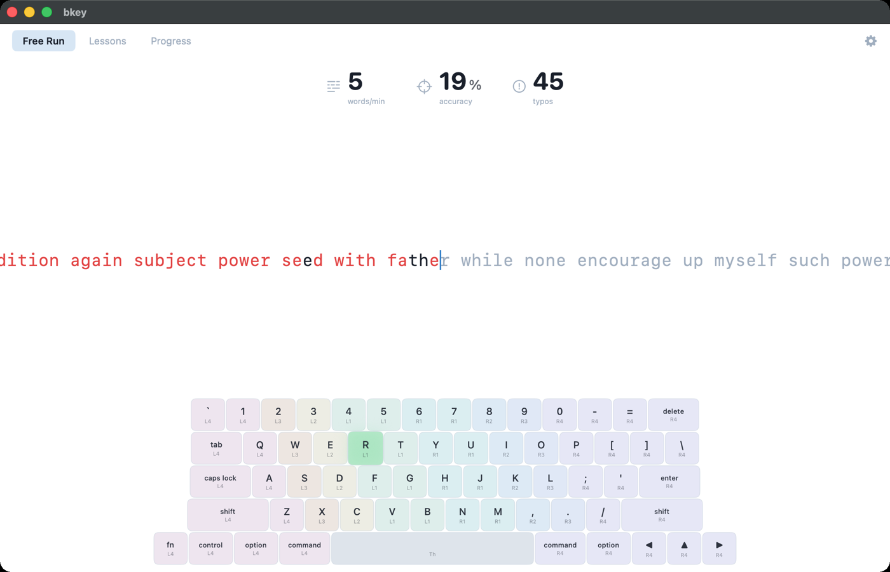
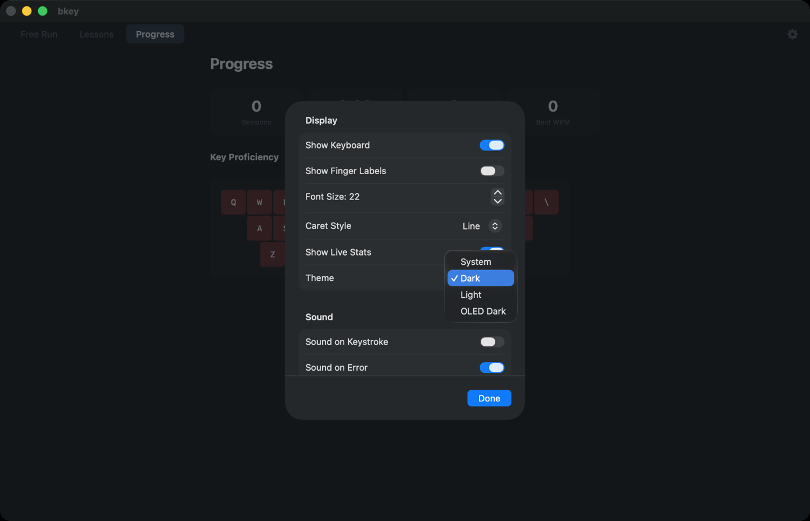

# bkey

[](https://github.com/nickspopov/bkey/actions/workflows/ci.yml)

A native macOS touch-typing tutor. Swift + SwiftUI, zero third-party dependencies.

bkey doesn't just count your WPM — it tracks per-key proficiency and feeds your weakest keys back into the next practice set, so every session targets what you actually struggle with.



## Features

- **Free Run** — Endless, Timed (15s / 30s / 60s / 2m), Word count (10 / 25 / 50 / 100), or paste your own Custom text.
- **Adaptive word selection** — `KeyProficiencyTracker` scores every key by speed and accuracy; ~60% of each new batch is built from words containing your weakest characters.
- **45 structured lessons** in 5 tiers: Home Row → Top Row → Bottom Row → Shift / Capitals → Punctuation / Numbers. Each lesson is a multi-exercise flow (introduction → letter drill → word practice → sentence practice → speed challenge) gated by WPM and accuracy thresholds.
- **Live on-screen keyboard** with the next key highlighted, optional finger-zone labels, and error flashes.
- **Error modes** — continue on error, force-correct, or stop on word.
- **Progress dashboard** — WPM over time, session history, per-key proficiency heatmap and lesson completion.
- **Themes** — Dark, Light and OLED, persisted across launches.
- **Sound feedback** — optional keystroke and error sounds.
- **Persistent** — SwiftData for sessions, lessons and key proficiency; settings in `UserDefaults`.

## Screenshots

**Words mode, mid-session** — live WPM / accuracy / typos and word counter:



**Lessons** — every lesson starts with an introduction of the new keys, then a drill (mistakes are marked in red):




**Session summary** — WPM, best WPM, accuracy, keystrokes, errors, duration:



**Progress** — WPM chart, recent sessions and key proficiency heatmap:



**Themes** — Light theme with finger labels, and the theme picker:




## Requirements

- macOS 26.0+
- Xcode 26.0+ (Swift 6, `SWIFT_DEFAULT_ACTOR_ISOLATION = MainActor`)

## Build & run

```bash
git clone git@github.com:nickspopov/bkey.git
cd bkey
xcodebuild -project bkey.xcodeproj -scheme bkey -configuration Debug \
  -derivedDataPath build CODE_SIGNING_ALLOWED=NO build
open build/Build/Products/Debug/bkey.app
```

Or open `bkey.xcodeproj` in Xcode, pick your signing team under *Signing & Capabilities*, and press ⌘R.

## Tests

```bash
# unit tests (Swift Testing)
xcodebuild -project bkey.xcodeproj -scheme bkey test -only-testing:bkeyTests

# UI tests (XCTest)
xcodebuild -project bkey.xcodeproj -scheme bkey test -only-testing:bkeyUITests
```

## Architecture

```
bkeyApp → ContentView → AppState (@Observable, central controller)
                          ├─ TypingSession        core typing engine, character states, WPM
                          ├─ WordGenerator        word batches (deterministic in tests)
                          ├─ AdaptiveWordSelector weakness-weighted word picking
                          ├─ KeyProficiencyTracker per-key confidence
                          ├─ LessonCurriculum / LessonFlowState  45 lessons, multi-exercise flow
                          └─ PersistenceManager   SwiftData container
```

Keyboard input: `KeyEventHandler` (NSEvent local monitor) → `AppState.handleCharacter / handleBackspace / handleEscape` → `TypingSession`.

`bkey/` is a `PBXFileSystemSynchronizedRootGroup` — new files are picked up automatically, no `.pbxproj` edits needed. See [CLAUDE.md](CLAUDE.md) and [DOCUMENTATION.md](DOCUMENTATION.md) for more.

## Shortcuts

- `Esc` — end the current session and show the summary
- `Space` — continue from a lesson introduction
- `Backspace` — correct within the current word

## License

[MIT](LICENSE)
